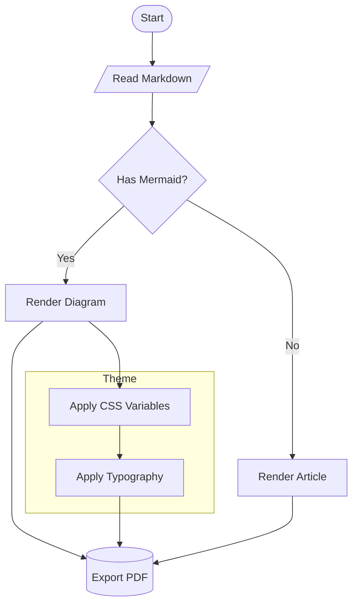
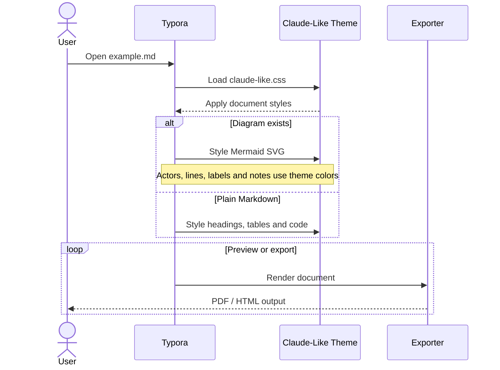
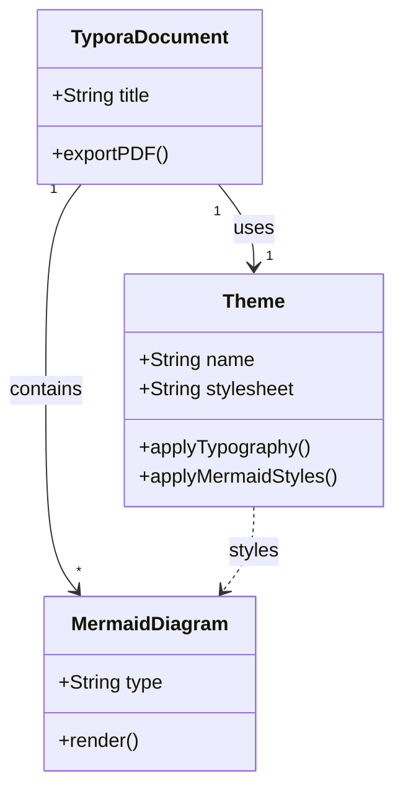
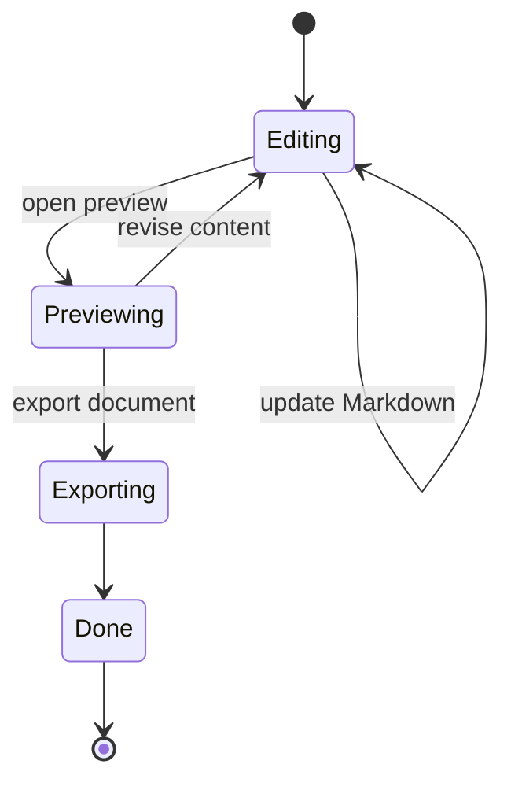
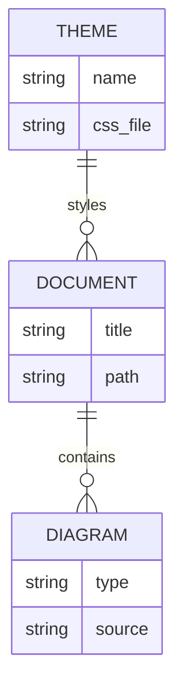
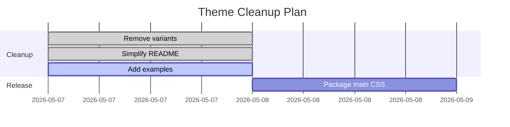
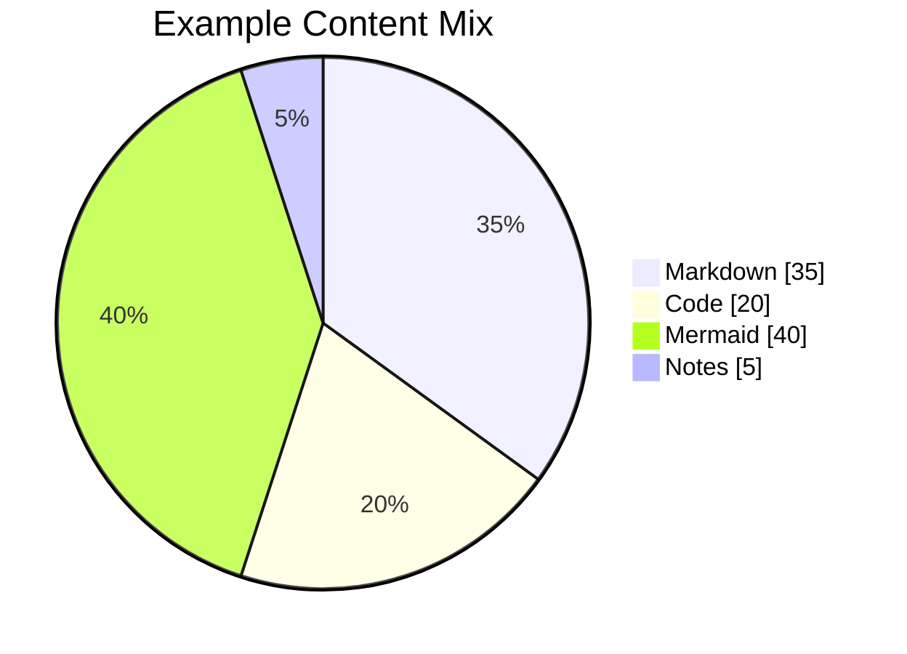
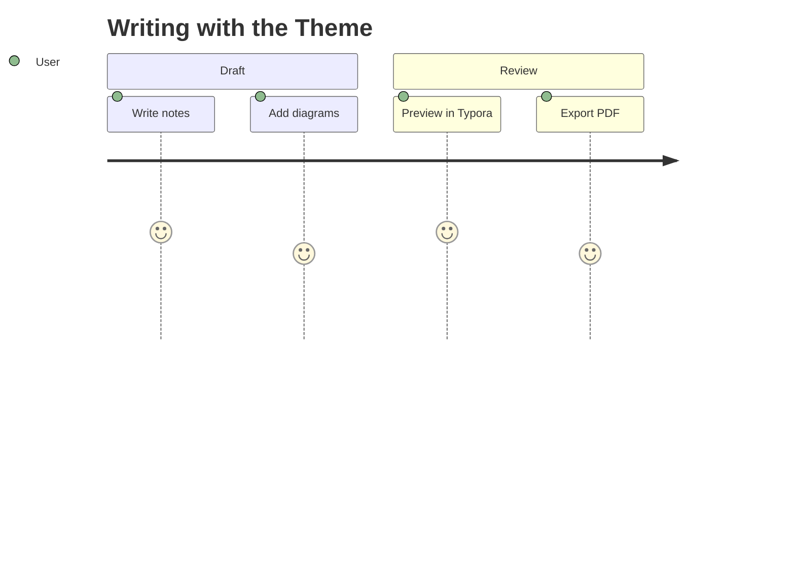
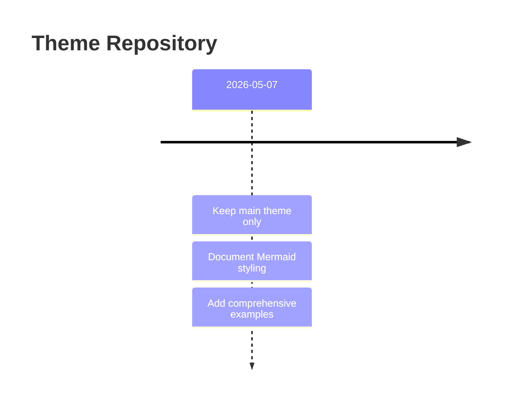

# Claude-Like Theme Example

这是一个用于检查 Typora 主题效果的示例文档，覆盖正文、表格、代码块和主要 Mermaid 图表元素。

## 基础 Markdown

你可以用它写技术笔记、课程总结、论文阅读记录，也可以整理 AI 对话内容。整体风格偏安静、简洁，适合持续阅读。

### 表格

| 功能     | 说明                 |
| -------- | -------------------- |
| 标题层级 | 更清晰               |
| 表格样式 | 更统一               |
| 代码高亮 | 更易读               |
| Mermaid  | 适配预览和导出样式   |

### 行内代码

比如 `print()`、`Hello, World!`、`claude-like.css` 这类内容会有单独样式。

### 代码块

```python
def hello(name: str) -> str:
    return f"Hello, {name}!"

print(hello("Typora"))
```

## Mermaid 示例

### Flowchart



### Sequence Diagram



### Class Diagram



### State Diagram



### Entity Relationship Diagram



### Gantt Chart



### Pie Chart



### User Journey



### Timeline


